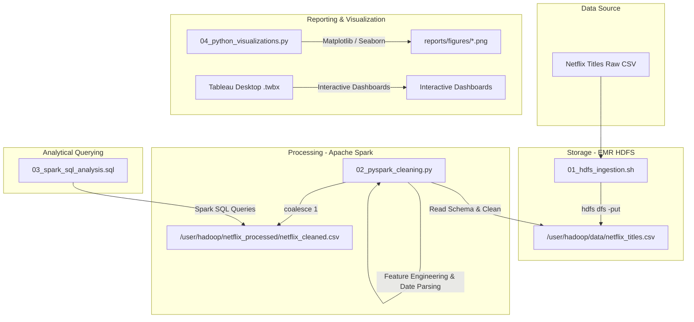
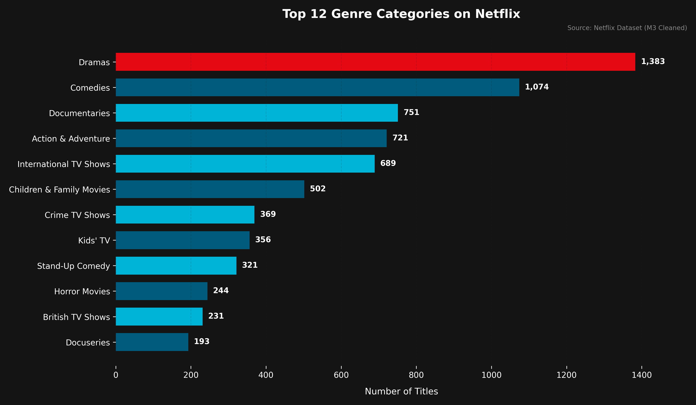
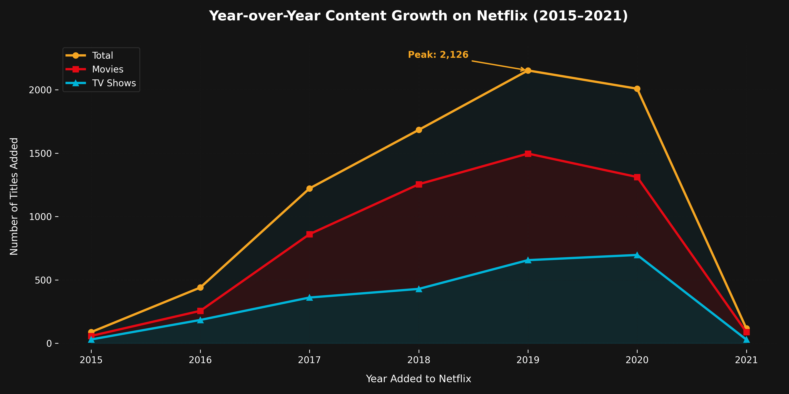
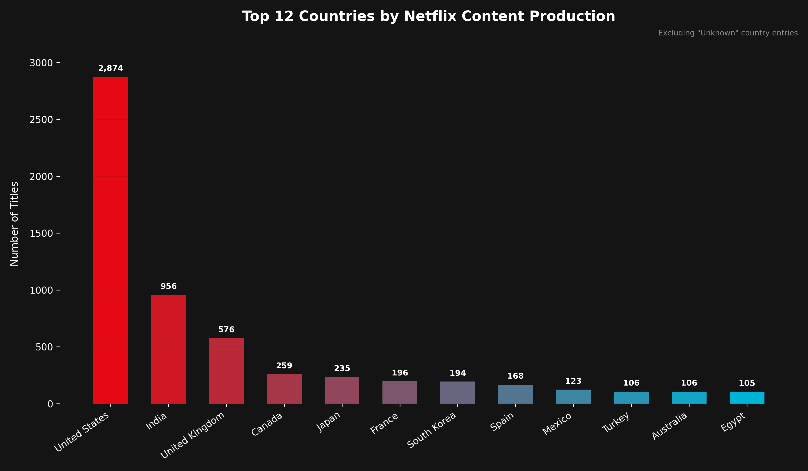
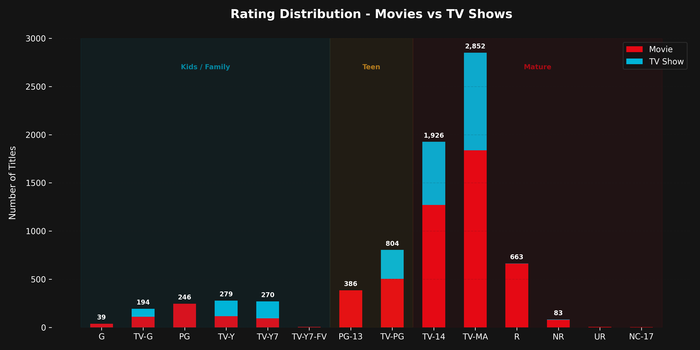
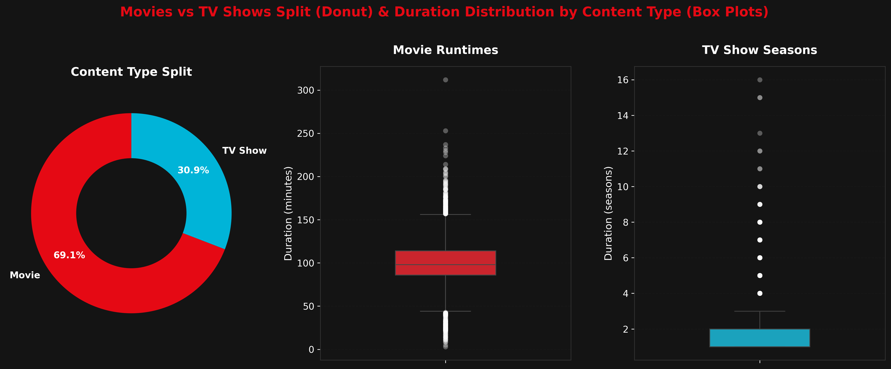
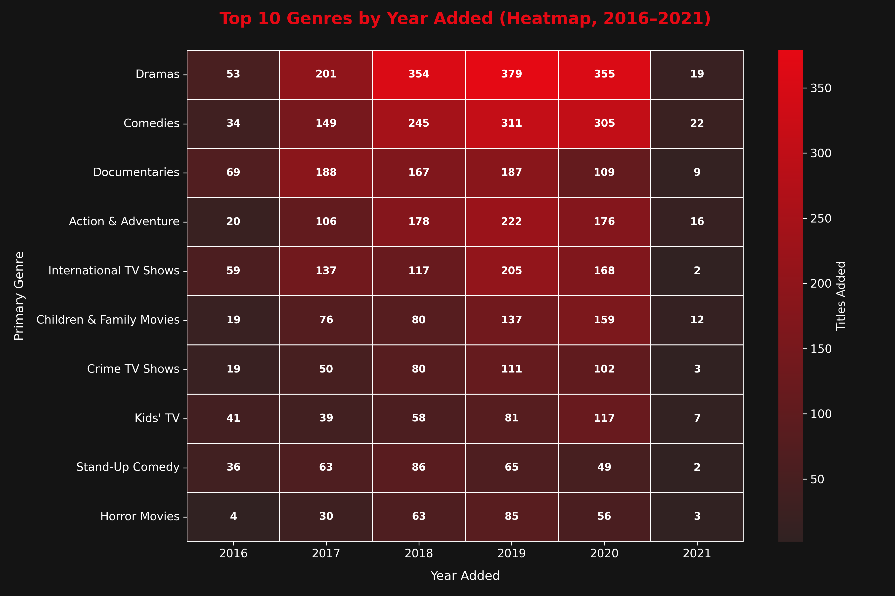

# Netflix Content Analysis — Big Data Pipeline
[](https://www.python.org/)
[](https://spark.apache.org/)
[](https://hadoop.apache.org/)
[](https://www.tableau.com/)

An end-to-end big data engineering and analytics pipeline designed to ingest, process, query, and visualize the Netflix titles dataset (~7,700 titles) on an Amazon EMR cluster. This project was developed as part of **CSP 554 — Big Data Technologies** at the **Illinois Institute of Technology**.

---

## 🏗️ Pipeline Architecture

The pipeline spans distributed ingestion in Hadoop HDFS, data wrangling and feature engineering in PySpark, analytical querying with Spark SQL, and reporting via Python visualizations and Tableau dashboards.


```text
netflix-big-data-pipeline/
├── data/
│   ├── raw/
│   │   ├── PLACEHOLDER.md          # Location for netflix_titles.csv
│   │   └── netflix_titles.csv      # Raw dataset (7,789 rows)
│   └── processed/
│       ├── PLACEHOLDER.md          # PySpark output location
│       └── netflix_cleaned.csv     # Cleaned dataset (7,770 rows, 20 columns)
├── src/
│   ├── 01_hdfs_ingestion.sh        # Milestone 2: HDFS folder creation and ingestion
│   ├── 02_pyspark_cleaning.py      # Milestone 3: Schema validation, null filling, and feature engineering
│   ├── 03_spark_sql_analysis.sql   # Milestone 4: SQL analytical queries for findings
│   └── 04_python_visualizations.py # Milestone 5: Dark-themed Matplotlib & Seaborn visualizations
├── reports/
│   └── figures/                    # Generated visualization figures (PNGs)
│       ├── genre_distribution.png
│       ├── content_growth.png
│       ├── geographic_breakdown.png
│       ├── rating_distribution.png
│       ├── type_and_duration.png
│       └── genre_year_heatmap.png
├── Netflix_Final_Report.pdf        # Final project documentation PDF
├── Netflix_Presentation.pptx       # Presentation deck
├── .gitignore                      # Git configuration to ignore datasets & environments
└── README.md                       # Project overview and guide
```

---

## 🛠️ Pipeline Stages & Implementations

### 1. Data Ingestion (`src/01_hdfs_ingestion.sh`)
Establishes the raw storage directories on the EMR Cluster's Hadoop Distributed File System (HDFS) and pushes the raw dataset to `/user/hadoop/data/netflix_titles.csv` for distributed executor access.

### 2. PySpark Processing & Feature Engineering (`src/02_pyspark_cleaning.py`)
Cleans and transforms raw CSV data via Apache Spark 3.5.6 using PySpark DataFrames:
* Enforces a static schema via `StructType` and `StructField`.
* Imputes missing strings for `director`, `cast`, and `country` with `"Unknown"`.
* Drops rows containing nulls in `date_added`, `rating`, or `duration`.
* Deduplicates titles by `show_id`.
* Parses string dates to a proper `DateType` (`YYYY-MM-DD`).
* **Engineers 8 custom columns** for downstream analytics:
  1. `date_added_parsed`: Clean date format.
  2. `year_added`: Extraction of the year.
  3. `month_added`: Extraction of the month.
  4. `country_primary`: The first country listed in multi-production fields.
  5. `genre_primary`: Primary genre (first category listed in `listed_in`).
  6. `genre_count`: Count of genres associated with the title.
  7. `duration_int`: Numeric duration extracted from strings.
  8. `duration_type`: Classification of runtime into `"minutes"` or `"seasons"`.

### 3. Structured Analysis (`src/03_spark_sql_analysis.sql`)
Includes SQL scripts that run on the Spark temporary view `netflix_cleaned`. These queries provide the counts, growth rates, distributions, and rankings described in the findings.

### 4. Static Visualization (`src/04_python_visualizations.py`)
Python script utilizing Matplotlib and Seaborn to generate publication-grade visualizations. Incorporates a unified, dark **Netflix UI Theme** (`#141414` background, `#E50914` Netflix Red accent, `#00B4D8` Teal secondary accent, and `#F5A623` Gold accent).

---

## 📊 Analytical Visualizations & Findings

### Figure 1: Genre Distribution
Dramas are Netflix's core catalog driver (1,373 titles), outnumbering Comedies (1,050) by over 300 titles. Documentaries and Action & Adventure round out the top four.


### Figure 2: Year-over-Year Content Growth (2015–2021)
Content volume grew exponentially to a peak in 2019 (2,126 titles added). Movie acquisitions consistently represent the largest share of annual volume.


### Figure 3: Geographic Breakdown (Top Countries)
Production is heavily concentrated in the United States (2,795 titles), with India (949 titles) and the United Kingdom (568 titles) representing the top international hubs.


### Figure 4: Rating Distribution by Format
Netflix catalog skews significantly mature, with TV-MA (2,797 titles) and TV-14 (1,900 titles) comprising over 62% of the library.


### Figure 5: Format Split and Duration Distributions
Movies comprise 69% of the catalog compared to 31% for TV Shows. Runtimes show a median of 100 minutes for movies and a median of 1 season for TV shows.


### Figure 6: Genre-Year Heatmap (2016–2021)
Cross-tabulating primary genres and year added highlights a consistent focus on Dramas and Comedies, with a peak across almost all genres in 2019.


---

## 🚀 Getting Started

### Prerequisites
* Python 3.10+
* PySpark 3.5+ & Apache Hadoop environment (for processing)
* Python packages for visualizations: `pandas`, `matplotlib`, `seaborn`, `numpy`

### Local Visualizations Generation
1. Clone this repository:
   ```bash
   git clone https://github.com/your-username/netflix-big-data-pipeline.git
   cd netflix-big-data-pipeline
   ```
2. Set up a virtual environment and install packages:
   ```bash
   python3 -m venv venv
   source venv/bin/activate
   pip install pandas matplotlib seaborn numpy
   ```
3. Run the visualization script:
   ```bash
   python src/04_python_visualizations.py
   ```
   The figures will be saved automatically in the `reports/figures/` directory.
